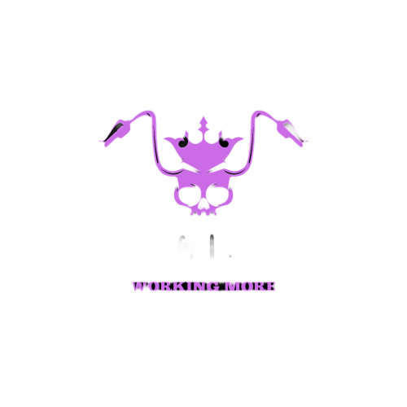

<body>

  

    

     
     
     
    

  

  

    
    

       
       
    

  

<table>
  <tr>
    <td valign="center">
      
🎓 I am currently majoring in **Computer Science** at **Ho Chi Minh City University of Technology**.

🌱 I learned **HTML, CSS, Javascript, Nodejs, Reactjs, C++** and am also keened on **Web Developer and Web3**.

🎯 My Goal is to contribute to as many **open source projects** as possible.

✨ I want to make some applications relating to **BlockChain** and **Web3** in the near future.

  </td>

  <td>
      
    </td>
  </tr>

</table>

</body>
